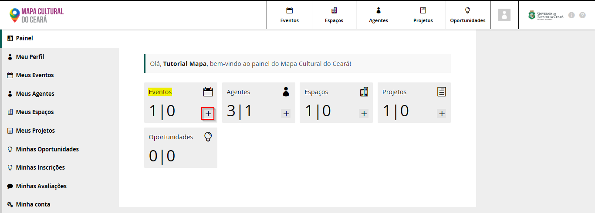
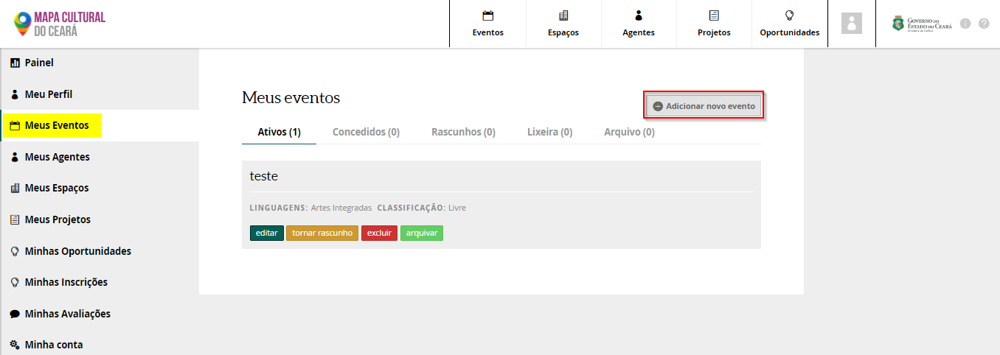
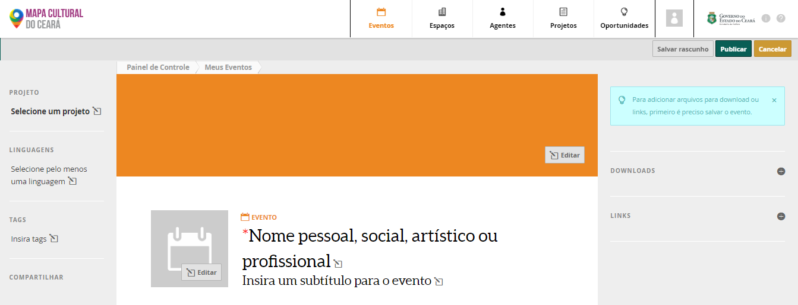
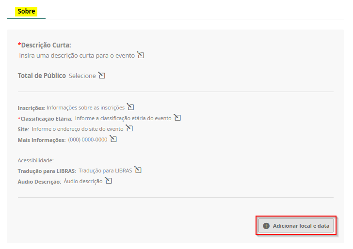
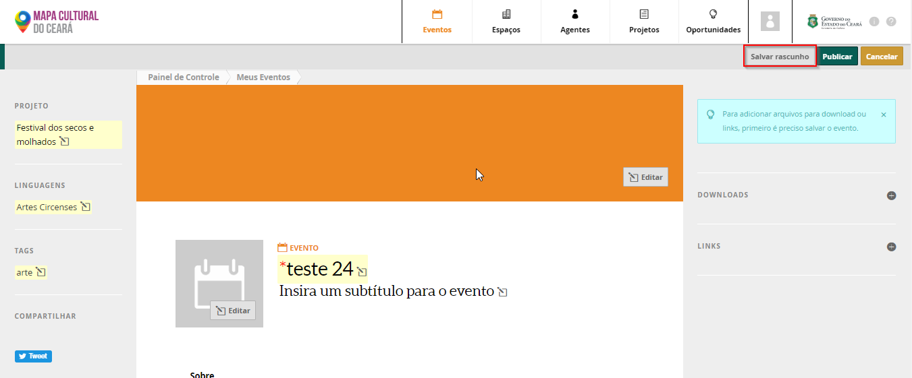
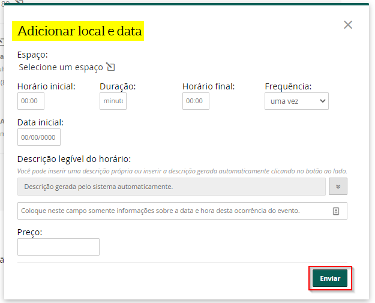
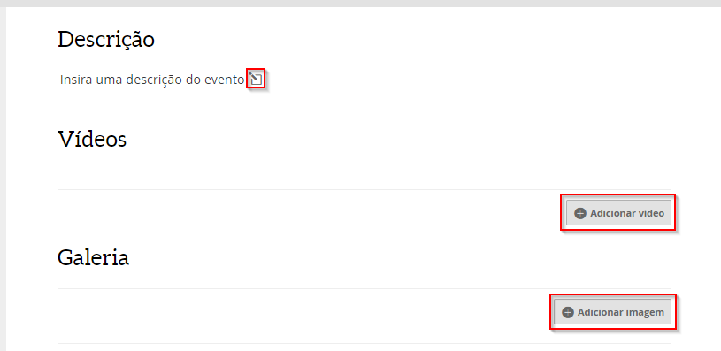
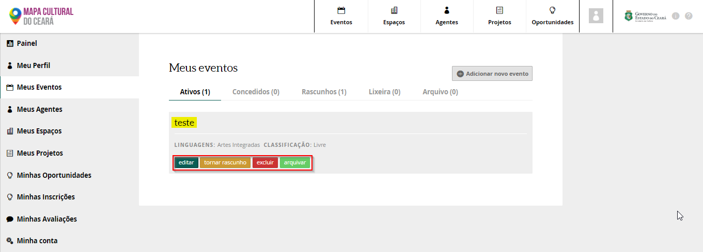

# Como criar um Evento

Para criar um evento no Mapa Cultural, você precisa acessar o Painel de Controle. Existem dois caminhos para criar o seu evento. 

O primeiro pode ser feito no Painel de Controle, onde aparece as informações de Evento, Agentes, Espaços, Projetos e Oportunidade. Basta clicar no botão `+` para criar um novo evento.

A segunda opção pode ser feito clicando em `Meus Eventos`, onde iriá aparecer informações mais detalhadas de onde o eventos ficam, quando são criados. Basta clicar no botão `Adicionar novo evento`, para criar o seu evento. 

### Customizando o Evento

Após clicar no botão de adicionar um evento você será direcionado para a página abaixo. 

Na coluna lateral esquerda você pode indicar um projeto de referência, a linguagem e tags \(palavras-chave\).

**Projeto**: O evento pode ser vinculado ao projeto que você criou dentro do Mapa Cultural. Para vincular ao projeto basta clicar no botão \(caneta dentro do quadrado\) e selecionar o projeto. 

**Linguagem:** Você pode selecionar a linguagem do evento, ele pode ser: Arte Visuais, Cursos ou Oficinas, Cultura Digital entre outros. 

**Tag:** Você pode colocar tag que podem ajudar na busca do seu evento dentro do Mapa Cultural

Você pode colocar um capa e avatar no evento, clicando no botão editar.

Precisar ser colocado um título para o evento, o subtítulo do evento é opcional.

Coloque as informações completa do seu evento: Descrição curta, Total de Público, Inscrições, Classificação Etária, Site, Mais Informações, Tradução para Libras e Áudio Descrição.


Todos os itens com asterisco são obrigatória


Após colocar as informações clique no botão salvar rascunho. E volte para o espaço Sobre, para colocar as informações de Data e Local

Informações adicionais e não obrigatórias, caso queira colocar uma descrição maior sobre o evento, essa informação pode ser colocar em Descrição. Se tiver video e fotos esses podem ser adicionados no respectivos botões Adicionar vídeo e Adicionar Imagem.

Você também pode colocar outros administradores do evento. Eles poderão fazer editar e fazer alterações no evento, caso seja necessário. Basta clicar no botão + para adicionar novos administradores. 

Após colocar das as informações do evento, clique no botão Publicar, para que o evento possa ficar visível no Mapa da Cultura

### Fazer alterações após publicação do evento

Caso seja necessário fazer alterações no evento, basta acessar o Painel de Controle e acesse Meus Eventos para editar. 

