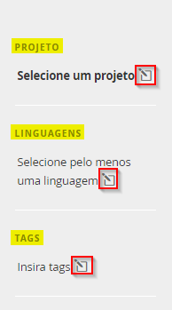
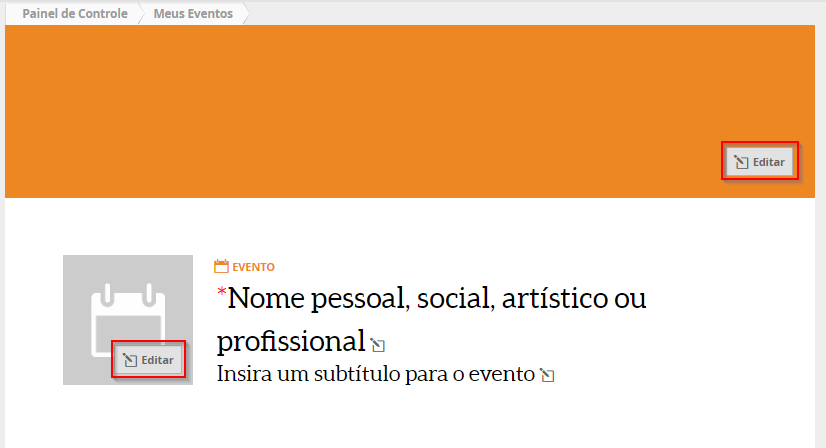
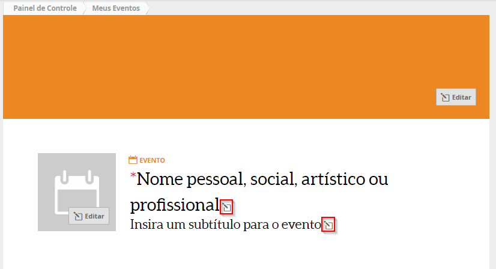

# Como criar um Evento

Para criar um evento no Mapa Cultural, você precisa acessar o Painel de Controle. Existem dois caminhos para criar o seu evento. 

O primeiro pode ser feito no Painel de Controle, onde aparece as informações de Evento, Agentes, Espaços, Projetos e Oportunidade. Basta clicar no botão + para criar um novo evento.

A segunda opção pode ser feito clicando em Meus Eventos, onde iriá aparecer informaçoes mais detalhadas de onde o eventos ficam, quando são criados. Basta clicar no botão Adicionar novo evento, para criar o seu evento. 

Ao clicar no botão o usuario será levando para a tela para criação do evento. E colocar as informações sobre o evento como: 

Projeto: O evento pode ser vinculado ao projeto que você criou dentro do Mapa Cultural. Para vincular ao projeto basta clicar no botão \(caneta dentro do quadrado\) e selecionar o projeto. 

Linguagem: Você pode selecionar a linguagem do evento, ele pode ser: Arte Visuais, Cursos ou Oficinas, Cultura Digital entre outros. 

Tag: Você pode colocar tag que podem ajudar na busca do seu evento dentro do Mapa Cultural

Você pode colocar um capa e avatar no evento, clicando no botão editar.

Precisar ser colocado um título para o evento "Show dos Batuqueiro", o subtítulo do evento é opcional.

