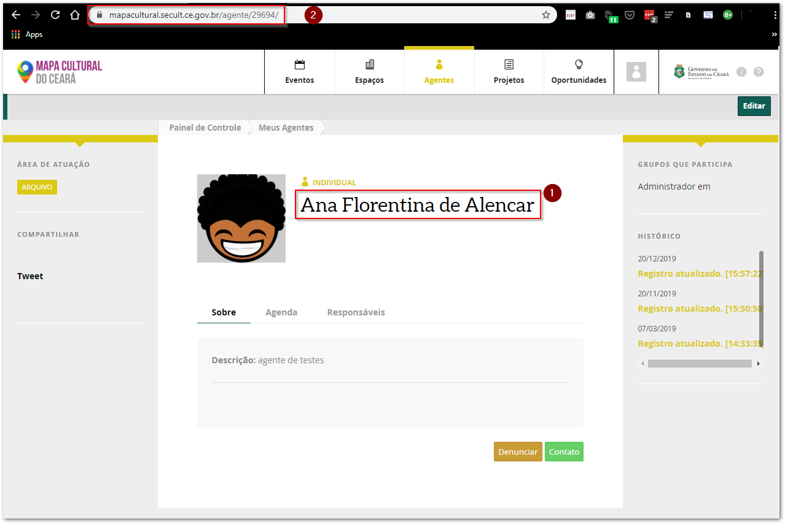
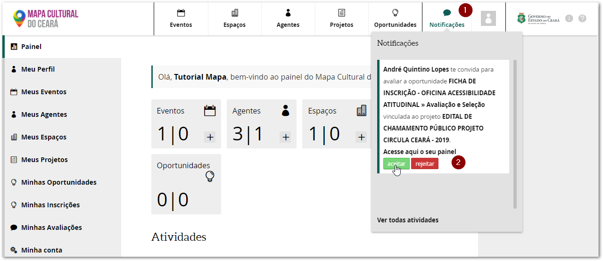
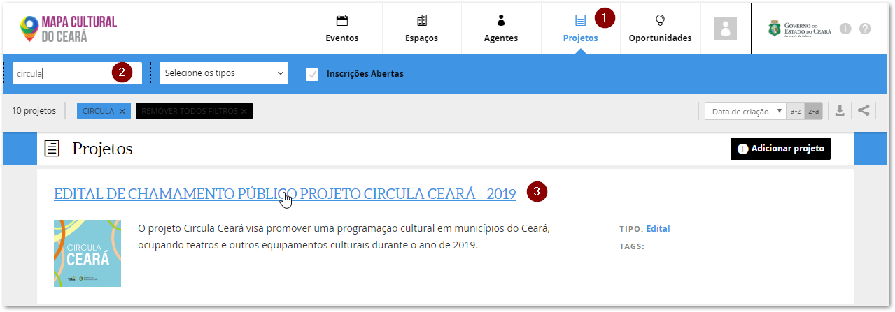
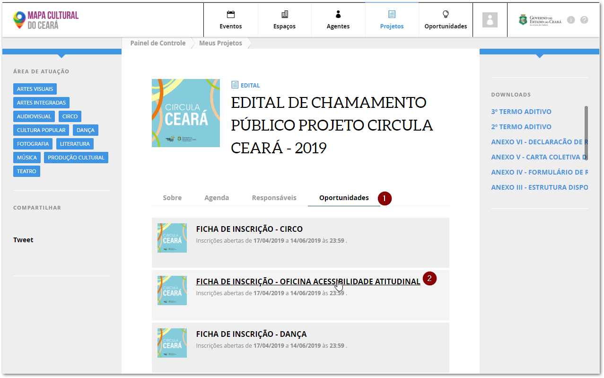
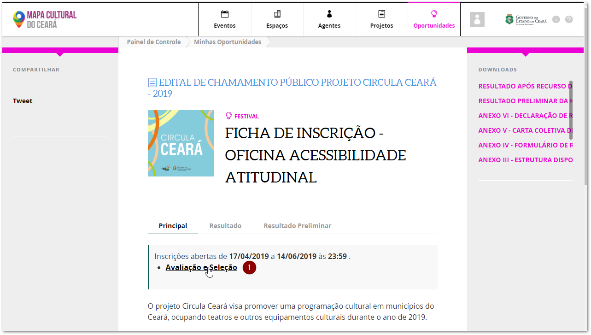
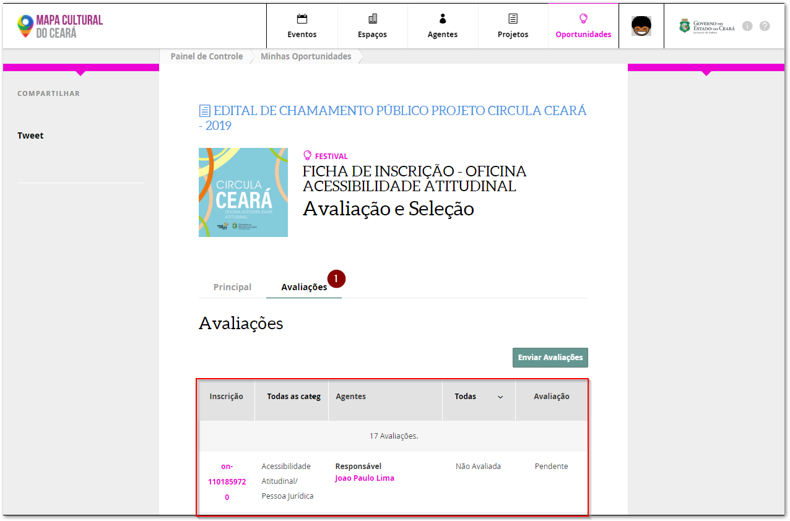
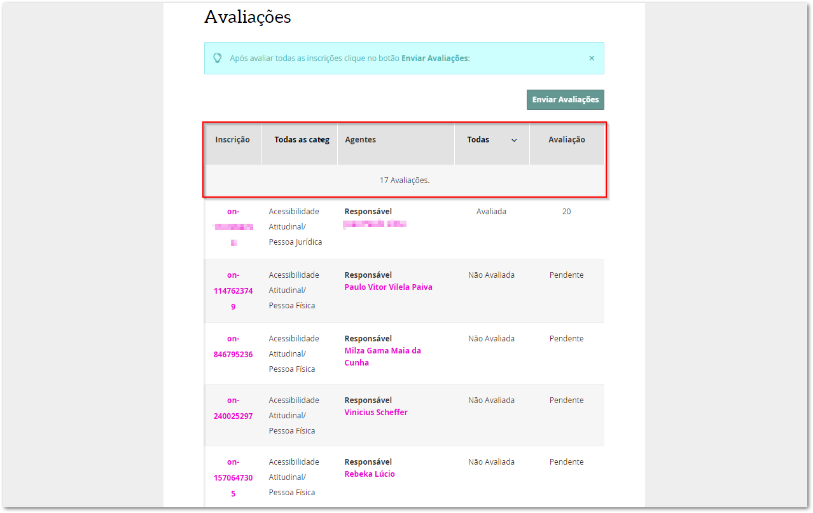
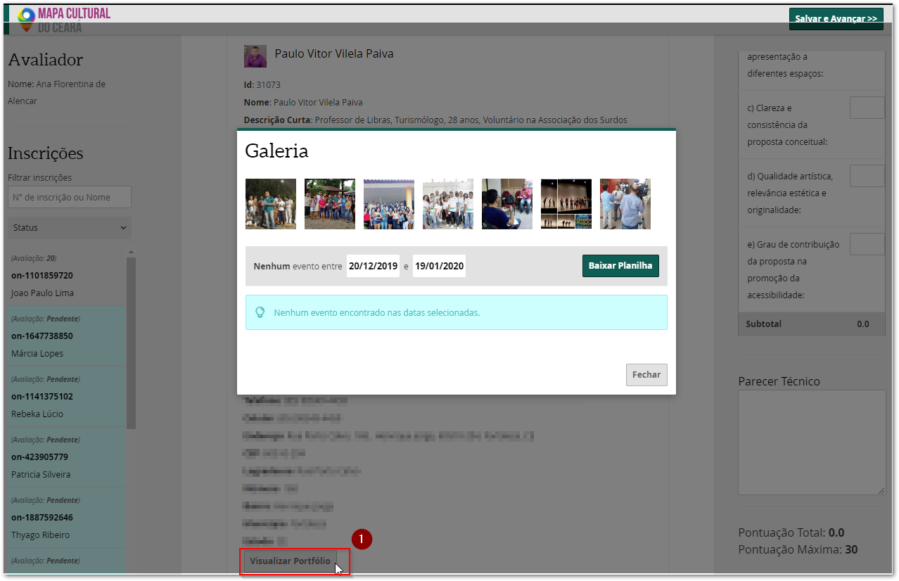
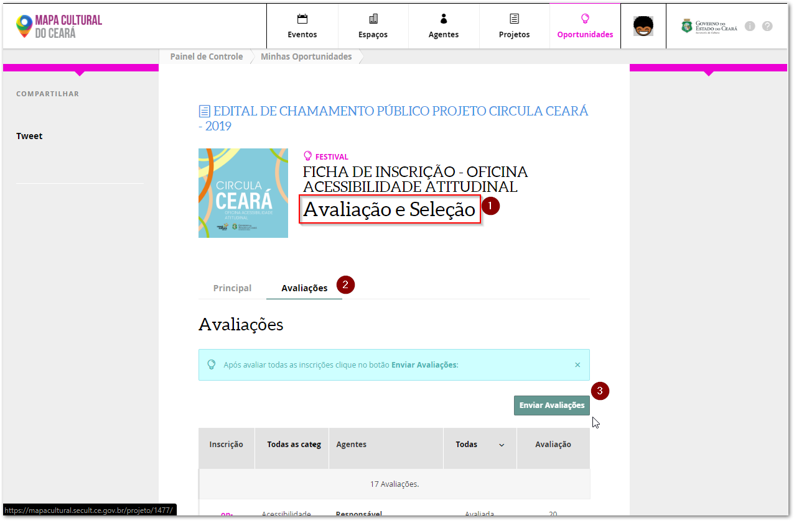
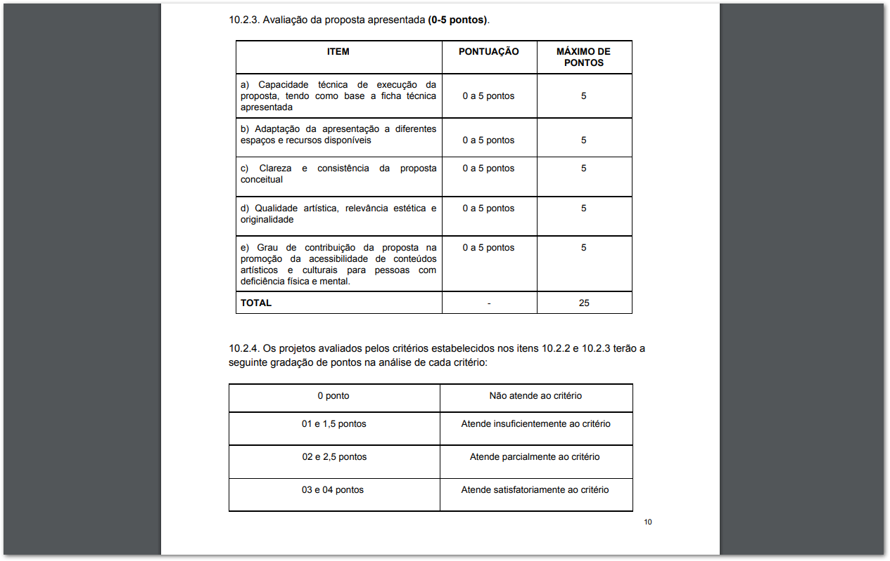

# Como fazer a avaliação técnica

### Requisito para avaliar e o aceite do convite

É preciso estar cadastrado no Mapa Cultural do Ceará para fazer uma avaliação. Caso não tenha cadastro veja a seção sobre [como fazer o seu cadastro no Mapa Cultural](https://mapas.gitbook.io/tutorial-para-o-usuario-do-mapa-cultural/primeiros-passos/como-fazer-o-seu-cadastro-no-mapa-cultural).

Você precisa informar ao coordenador do edital o nome do agente cadastrado \(número 1 da imagem\) ou o link do agente \(número 2\).

Quando o coordenador te adicionar como avaliador, você receberá uma notificação. Ela aparecerá no menu principal, basta clicar no botão `Notificações` e, em seguida, em `aceitar`.

### Como encontrar a oportunidade que irá avaliar

O coordenador do projeto provavelmente lhe enviará o link para acessar o edital e as propostas que serão avaliadas. Caso isso não ocorra, você pode encontra-ló a partir do menu `projetos`. 

Escreva o nome do edital no campo de busca. Como exemplo, avaliaremos o **Edital de Chamamento Público Projeto Circula Ceará - 2019** na categoria **Oficina Acessibilidade Atitudinal**. Depois, basta clicar no nome do edital.

Dentro do edital, clique na aba `Oportunidades` e selecione a categoria específica. 

A avaliação deste edital compreendeu duas fases, a habilitação documental \(página para o qual fomos direcionados\) e a avaliação e seleção \(fase que iremos avaliar\), por isso, precisamos clicar no link para a `Avaliação e Seleção`.

Como você aceitou o convite, aparecerá uma aba `Avaliações`. Clique nela e você verá uma tabela com todas as inscrições que precisa avaliar.

### Visualizando a inscrição e fazendo a avaliação

A tabela dos inscritos possui cinco colunas com as seguintes informações:

* `Inscrição`:  apresenta o número de inscrição e o link para entrar na ficha; 
* `Todas as categorias`: apresenta a categoria selecionada na ficha de inscrição. É possível clicar no cabeçalho e selecionar a categoria;
* `Agentes`: apresenta o nome do agente responsável pela inscrição e o link para entrar no perfil;
* `Todas`: apresentar o status da avaliação. É possível clicar no cabeçalho e selecionar um status;
* `Avaliação`: apresenta a nota dada.

No exemplo abaixo só foi avaliado o primeiro projeto da lista que recebeu nota 20. 


Nota: o sistema organiza automaticamente os projetos da maior para a menor nota.


Para ter acesso a ficha basta clicar no número da inscrição. No exemplo abaixo clicamos na inscrição on-1147623749. A tela com a ficha de inscrição possui três partes:

1. Apresenta a lista com os projetos a serem avaliados. Nela é possível identificar as inscrições que ainda estão pentes de avaliação e a nota que foi atribuída para as avaliadas. Também possui um campo busca.
2. Apresenta o perfil da agente que se inscreveu e o projeto na íntegra.
3. Apresenta os campos onde serão dadas as notas e o parecer técnico.


Nota: o sistema só permite `Salvar e Avançar` para o próximo projeto quando todas as notas e o parecer técnico forem preenchidos.



Nota: é possível fazer alterações nas notas e no parecer técnico após clicar no botão de `Salvar e Avançar`.


Descendo na parte do central você encontrará o perfil do Agente Responsável e, dependendo do tipo da inscrição, o perfil da Instituição Responsável \(grupo formalizado com CNPJ\) ou do Coletivo \(grupo informal\). Para ver as fotos, vídeos, documentos e eventos cadastradas no perfil, basta clicar no botão`Visualizar Portfólio`.

Após avaliar todo o projeto você irá dar as notas e o parecer técnico de acordo com as especificações do edital.

### Finalizando a avaliação

Você pode retornar para a tabela com todas as inscrições clicando no nome da fase e em seguida na aba `Avaliações`.

O botão `Enviar Avaliações` fica ativo somente quando todos os projetos são avaliados. Ao clicar neste botão **não é mais possível** alterar qualquer nota ou parecer. Então só se deve clicar neste botão após a reunião de alinhamento que será proposta pelo coordenador do projeto.
 

### Considerações sobre as notas e o parecer

O edital apresenta os critério a serem avaliados, assim como a escala de pontos que deve ser seguida. Neste exemplo \([Edital de Chamamento Público Projeto Circula Ceará](https://mapacultural.secult.ce.gov.br/files/opportunity/1367/edital-de-chamamento-publico-projeto-circula-ceara.pdf)\) as notas possíveis são: 0 \| 1 \| 1,5 \| 2 \| 2,5 \| 3 \| 4 . Por isso, deve-se evitar outras notas como 2,3.

A SECULT recomenda cuidado ao atribuir a nota zero. Essa nota  deve ser utilizada apenas em caso excepcional, onde há constatação de inadequação do projeto ao objeto do edital.

Sobre o parecer a	ser	elaborado, ele segue a metodologia de pontuação justificada, na qual cada item recebe uma pontuação em função da qualidade da proposta, julgada em base das informações contidas e qualquer informação adicional a disposição no projeto. Esta pontuação deve ser justificada pelo parecerista, que poderá apresentar, quando necessário, sugestões de melhoria da proposta relativas a cada item.

Não use a avaliação quantitativa de forma mecânica, ela somente deve ajudar na avaliação sistemática das propostas. Se você estiver convencido que um projeto é bom ou ruim, mas o resultado de sua Avaliação Quantitativa Final chega a outro resultado, reavalie sua pontuação.
 

Conheça mais informações sobre[ o projeto do Mapa Cultural do Ceará](https://cultura-ceara.gitbook.io/tutorial-para-o-usuario-do-mapa-cultural/primeiros-passos/sobre-o-mapa-cultural-do-ceara) e boa avaliação!

