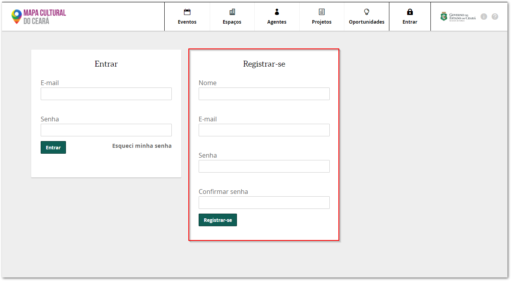
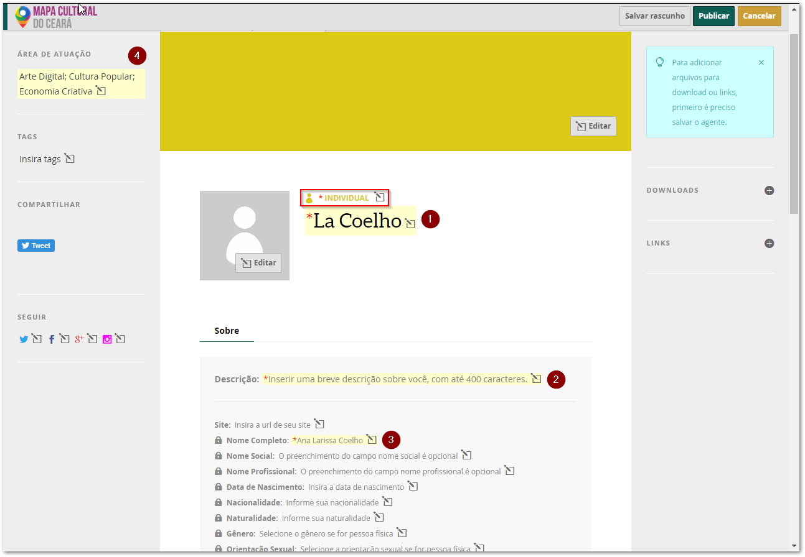
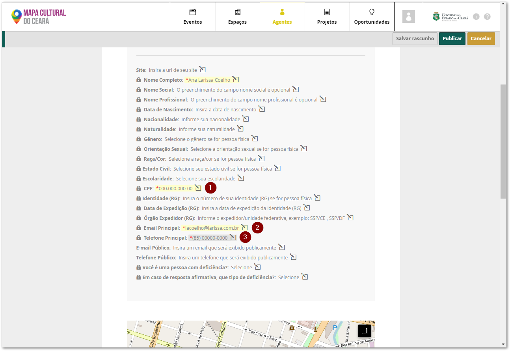
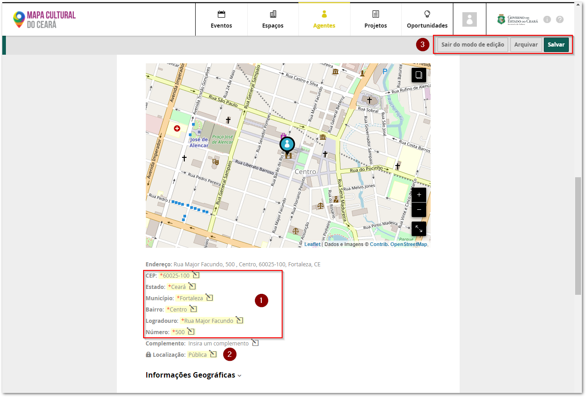
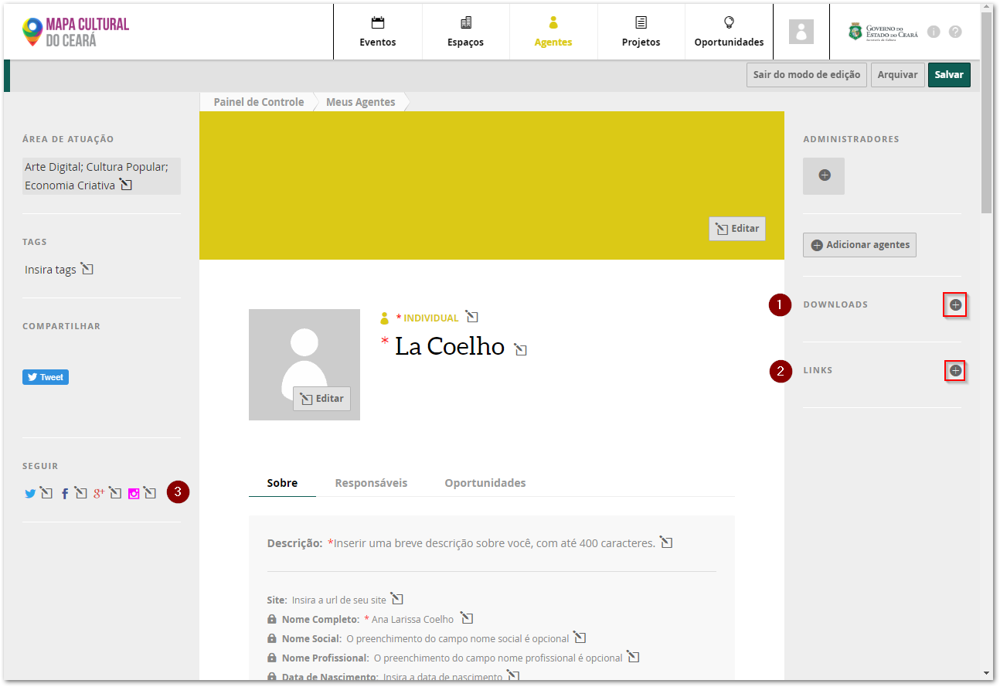

# Como fazer o seu cadastro no Mapa Cultural

### Iniciar o cadastro

Aqui está o link para você criar seu cadastro no Mapa Cultural do Ceará.
 Para se cadastrar preencha os campos com o seu nome, e-mail, crie uma senha com no mínimo 6 caracteres, confirme a senha e clique no botão `Registrar-se`.



Pronto! Você já está cadastrado na plataforma Mapa Cultural do Ceará. Agora, vamos terminar de preencher o perfil do seu agente cultural individual.

### Preencher os dados cadastrais obrigatório no perfil

Você deve ser direcionado para a página de edição do seu perfil. Vamos seguir o nosso passo a passo utilizando como exemplo a Ana Larissa Coelho. O Cadastro Individual é bem simples. Logo acima do seu nome social \(o nome como você gosta de ser chamado e como será encontrado na plataforma do Mapa Cultural\), deve aparecer a palavra “individual”. Isso que dizer basicamente que esse é um cadastro de uma pessoa física, com CPF. 


**ATENÇÃO**  você deve fazer **PRIMEIRO** seu cadastro na plataforma do Mapa Cultural como **Pessoa Física \(Agente Individual\)**. 


Neste primeiro caso vamos considerar o preenchimento com as informações mínimas solicitas pela plataforma. Preencha os seus dados cadastrais clicando no campo desejado, depois escreva ou selecione a informação correta e clique em enviar. Perceba que o campo ficará marcado de amarelo indicando que as informações ainda estão como rascunho.

Nesta primeira parte da tela os campos obrigatórios são:

1. Nome social
2. Descrição: escreva um texto curso sobre você com no máximo 400 caracteres
3. Nome completo
4. Área de atuação: é uma lista com opções definidas. A medida que você escreve aparecem as opções. Você pode escolher quantas áreas quiser.
 

> Dica 1: utilize o campo de `TAGS` \(palavras chave\) caso você queria detalhar a sua área de atuação ou inserir uma área que não está listada.

> Dica 2: Caso pretenda participar de alguma chamada ou edital você também deverá preencher os campos desta lista.

Descendo um puco a tela você encontrará outros campos obrigatório, são eles:

1. CPF
2. E-mail principal
3. Telefone principal com o DDD

Por fim é preciso preencher as informações do endereço e clicar em `Salvar.`

1. Informações sobre o endereço de residência: CEP, Estado, Município, Bairro, Logradouro \(rua ou avenida\) e Número.
2. Localização: neste campo você informar se o seu endereço deve ficar como `Público` \(todos do mapas podem encontrar o seu endereço\) ou `Privado` \(somente você e as pessoas que criarem as oportunidade podem ter acesso ao seu endereço\)
3. Botão Salvar

> Após clicar no botão de salvar, note que os campos não estão mais marcados de amarelo, indicando que suas informações foram salvas.

### Como adicionar documentos e links

Você também pode anexar dados profissionais ao seu perfil. Veja como fazer:

1. **Anexar histórico, currículo, release, clipping de mídia ou outros tipos de documentos** \(recomendado no formato PDF com tamanho máximo de 5MB\)**.**
    Para adicionar esses documentos clique no sinal de `+` ao lado da guia `DOWNLOADS`. Digite o título do documento, depois clique no botão `Escolher arquivo` e selecione, no seu computador, o documento desejado. Por fim, clique em `Enviar`. Agora você verá que o documento aparecerá automaticamente na seção `DOWNLOADS`.
2.  **Incluir links de áudio e outros sites.** Clique no sinal de `+` ao lado da guia `LINKS`, que está na lateral direita. Primeiro cole o endereço do link que você deseja incluir no perfil, depois digite o título que aparecerá e, por fim, clique no botão `Enviar`. Agora você verá que o link aparecerá automaticamente na seção `LINKS`.
3. **Incluir links das redes sociais.**
    No lado direito, você encontra a seção `SEGUIR` com o ícone das redes sociais Twitter, Facebook e Google +. Clicando em cada uma delas, você pode adicionar o endereço das suas redes sociais ao seu perfil do mapa.

> Dica 3: fizemos [este manual com dicas de como juntar e compactar arquivos no formato PDF](https://cultura-ceara.gitbook.io/dicas/).

### Como adicionar imagens e vídeos

1. **Incluir vídeos.**
    Para inserir o vídeo desça até a seção Vídeos e clique no botão `Adicionar vídeo`. Você pode adicionar o link de um vídeo que está no [Youtube](https://youtube.com/) ou no [Vimeo](https://vimeo.com/pt-br/). Cole o link do vídeo no campo indicado, escreva um título e clique em `Enviar`. Feito isso, você verá que o vídeo será adicionado automaticamente na página do seu perfil.
2. **Incluir imagens** \(precisam  estar no formato JPG  ou PNG no tamanho máximo de 5MB\).
    Na seção galeria e clique no botão `Adicionar imagem`. Em seguida, informe o título da imagem, clique no botão `Escolher arquivo` e selecione, no seu computador, a imagem desejada. Por fim, clique em `Enviar`. Você verá que a imagem aparecerá automaticamente na seção galeria. Para  inserir mais imagens, repita a mesma operação.

### Campos obrigatórios para a inscrições no editais

Também será necessário preencher os seguintes campos para fazer a inscrição nos editais:

* Data de Nascimento
* Nacionalidade
* Naturalidade
* Gênero
* Raça/Cor
* Identidade \(RG\)
* Data de Expedição \(RG\)
* Órgão Expedidor \(RG\)

